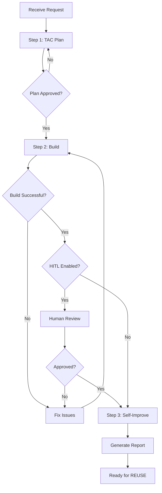

# TAC Expert - Plan Build Improve Workflow

> Complete TAC implementation cycle: **plan → build → self-improve**. This is the full ACT → LEARN → REUSE workflow embodying TAC Agent Expert principles.

## Purpose
Execute a complete TAC-informed implementation cycle by chaining three commands:
1. **Plan** (ACT) - Create TAC-informed implementation plan
2. **Build** (ACT) - Execute the implementation
3. **Self-Improve** (LEARN) - Update expertise with new patterns discovered

## Usage
```
/experts:tac:plan_build_improve [request] [human_in_the_loop]
```

## Allowed Tools
`Task`, `TaskOutput`, `TodoWrite`, `SlashCommand`

## Variables
- **USER_PROMPT**: The implementation request
- **HUMAN_IN_THE_LOOP**: `true/false` (default: true)

---

## The ACT → LEARN → REUSE Pattern

```
┌─────────────────────────────────────────────────────────┐
│                    ACT → LEARN → REUSE                   │
├─────────────────────────────────────────────────────────┤
│                                                          │
│  ┌─────────┐     ┌─────────┐     ┌─────────┐           │
│  │   ACT   │ ──► │  LEARN  │ ──► │  REUSE  │           │
│  └─────────┘     └─────────┘     └─────────┘           │
│      │               │               │                   │
│      ▼               ▼               ▼                   │
│  Plan & Build    Self-Improve    Next Execution         │
│  implementation  expertise.md    uses updated           │
│                                  mental model            │
│                                                          │
└─────────────────────────────────────────────────────────┘
```

---

## Workflow Steps

### Step 1: Create TAC-Informed Plan (ACT)

```
Task(
  subagent_type: "general-purpose",
  prompt: "Run /experts:tac:plan [USER_PROMPT]"
)
```

**Output**: Path to generated plan file in `specs/`

**TAC Analysis Included**:
- Problem classification
- Autonomy level target
- Primitive selection
- Validation strategy
- Context engineering
- Agent pattern selection

---

### Step 2: Build Implementation (ACT)

```
Task(
  subagent_type: "general-purpose",
  prompt: "Run /build [path_to_plan]"
)
```

**Output**: Summary of files changed

**If HUMAN_IN_THE_LOOP = true**:
- Pause for review before proceeding
- Allow iteration on implementation

---

### Step 3: Self-Improve Expertise (LEARN)

```
Task(
  subagent_type: "general-purpose",
  prompt: "Run /experts:tac:self-improve"
)
```

**Output**: Self-improvement report with updated expertise

**Updates Captured**:
- New patterns discovered during implementation
- Discrepancies between plan and reality
- Improved tactics or frameworks
- New validation approaches

---

## Flow Control



---

## Report Format

```markdown
# Plan Build Improve Workflow Summary

## Request
{Original user request}

## TAC Analysis Applied
- **Problem Type**: {classification}
- **Autonomy Level**: {In-Loop | Out-Loop | Zero-Touch}
- **Primary Tactics Used**: {list}
- **Primitives Created**: {list}

## Step 1: Planning
- **Plan File**: `specs/{feature-name}.md`
- **TAC Recommendations**: {summary}

## Step 2: Build
- **Files Changed**: {count}
- **New Files**: {list}
- **Modified Files**: {list}
- **Validation Results**: {pass/fail}

## Step 3: Self-Improve
- **Discrepancies Found**: {count}
- **Expertise Updates**:
  - {Update 1}
  - {Update 2}

## Final Status
✅ TAC implementation workflow complete

## Next REUSE Opportunity
{When/how this expertise can be reused}
```

---

## Examples

### Example 1: Feature Implementation
```
/experts:tac:plan_build_improve "Add user authentication with JWT"
```

**Workflow**:
1. **Plan**: Creates TAC-informed plan covering:
   - Problem class: Security pattern (use existing template)
   - Autonomy: Out-Loop (well-defined pattern)
   - Primitives: ADW (plan_build_review)
   - Validation: Unit tests + integration tests

2. **Build**: Implements JWT auth following plan

3. **Self-Improve**: Captures:
   - JWT-specific patterns for future auth tasks
   - Validation commands that worked
   - Context requirements for auth implementations

### Example 2: ADW Creation
```
/experts:tac:plan_build_improve "Create an ADW for database migrations"
```

**Workflow**:
1. **Plan**: TAC analysis identifies:
   - Problem class: Meta-agentic (ADW creation)
   - Reference: orchestrator-agent-with-adws patterns
   - Primitives: Template meta-prompt

2. **Build**: Creates migration ADW

3. **Self-Improve**: Updates:
   - ADW catalog count
   - New migration pattern documentation
   - Links to related ADWs

### Example 3: Agent Development
```
/experts:tac:plan_build_improve "Build a code review agent"
```

**Workflow**:
1. **Plan**: TAC analysis:
   - Agent pattern: Calculator (tool-heavy)
   - System prompt strategy: Append
   - Model selection: Sonnet for balanced performance

2. **Build**: Implements review agent

3. **Self-Improve**: Captures:
   - Review agent patterns
   - Effective review prompts
   - Tool selection learnings

---

## Autonomy Configuration

| Mode | Description |
|------|-------------|
| `human_in_the_loop: true` | Pause for approval after Plan and Build |
| `human_in_the_loop: false` | Run all three steps automatically |

**Recommended**: Start with `true` until confidence in workflow reaches 90%+

---

## Integration with Other Experts

This workflow can chain with other domain experts:

```
/experts:tac:plan_build_improve "Add WebSocket event broadcasting"
```

→ May invoke `/experts:websocket:question` during planning
→ May invoke `/experts:adw:plan` for ADW-specific guidance
→ May invoke `/experts:database:question` for persistence patterns

---

## Key Insight
> This workflow ensures the TAC expert **learns from every implementation**. After building, the expertise file is updated to reflect new patterns, making the expert smarter for the next execution. This is the essence of ACT → LEARN → REUSE.

---

## When to Use This Workflow

| Scenario | Recommendation |
|----------|---------------|
| Simple bug fix | Skip - use direct fix |
| One-off feature | Consider - captures learnings |
| Repeating pattern | Use - builds reusable expertise |
| Complex system | Definitely use - maximizes learnings |
| New problem domain | Definitely use - builds new expertise |

---

## Anti-Patterns to Avoid

1. **Skipping Self-Improve**: Loses learnings from implementation
2. **Manual Expertise Updates**: Let the workflow maintain expertise
3. **Ignoring TAC Analysis**: Missing optimization opportunities
4. **No Validation Strategy**: Can't close the feedback loop
