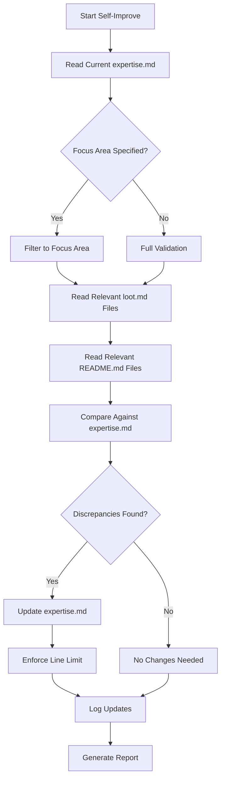

# TAC Expert - Self-Improve Mode

> Maintain TAC expertise accuracy by validating against BOTH source locations. This is the **LEARN** step of ACT → LEARN → REUSE.

## Purpose
Synchronize the TAC expertise file against the authoritative source materials from:
1. **TAC-Learning-System** (Obsidian) - Theory, loot.md files
2. **Desktop/tac** - Project implementations, README.md files

## Usage
```
/experts:tac:self-improve [focus_area]
```

## Allowed Tools
`Read`, `Grep`, `Glob`, `Bash`, `Edit`, `Write`, `TodoWrite`

## Variables
- **FOCUS_AREA**: Optional specific area to prioritize (e.g., "tactics", "frameworks", "patterns")
- **MAX_LINES**: 1500 (enforced limit for expertise.md)

---

## Source Validation Checklist

### SOURCE 1: TAC-Learning-System (15 loot.md files)

| File | Last Validated | Status |
|------|---------------|--------|
| `quizzes-and-diagrams/tac-1/loot.md` | | |
| `quizzes-and-diagrams/tac-2/loot.md` | | |
| `quizzes-and-diagrams/tac-3/loot.md` | | |
| `quizzes-and-diagrams/tac-4/loot.md` | | |
| `quizzes-and-diagrams/tac-5/loot.md` | | |
| `quizzes-and-diagrams/tac-6/loot.md` | | |
| `quizzes-and-diagrams/tac-7/loot.md` | | |
| `quizzes-and-diagrams/tac-8/loot.md` | | |
| `quizzes-and-diagrams/elite-context-engineering/loot.md` | | |
| `quizzes-and-diagrams/agentic-prompt-engineering/loot.md` | | |
| `quizzes-and-diagrams/building-specialized-agents/loot.md` | | |
| `quizzes-and-diagrams/multi-agent-orchestration/loot.md` | | |
| `quizzes-and-diagrams/orchestrator-agent-with-adws/loot.md` | | |
| `quizzes-and-diagrams/agent-experts/loot.md` | | |
| `quizzes-and-diagrams/software-delivery-adw/README.md` | | |

### SOURCE 2: Desktop/tac (25 README.md files)

**Core Projects (8)**:
| Directory | Last Validated | Status |
|-----------|---------------|--------|
| `tac-1/README.md` | | |
| `tac-2/README.md` | | |
| `tac-3/README.md` | | |
| `tac-4/README.md` | | |
| `tac-5/README.md` | | |
| `tac-6/README.md` | | |
| `tac-7/README.md` | | |
| `tac-8/*/README.md` (5 sub-apps) | | |

**Specialized Projects (12)**:
| Directory | Last Validated | Status |
|-----------|---------------|--------|
| `agentic-finance-review/README.md` | | |
| `agent-experts/README.md` | | |
| `agent-sandboxes/README.md` | | |
| `building-domain-specific-agents/README.md` | | |
| `claude-code-damage-control/README.md` | | |
| `claude-code-hooks-mastery/README.md` | | |
| `fork-repository-skill/README.md` | | |
| `multi-agent-orchestration-the-o-agent/README.md` | | |
| `orchestrator-agent-with-adws/README.md` | | |
| `rd-framework-context-window-mastery/README.md` | | |
| `seven-levels-agentic-prompt-formats/README.md` | | |

### Catalog Validation (5 catalogs)

| Catalog | Location | Status |
|---------|----------|--------|
| ADWs | `index/adws/README.md` | |
| Agents | `index/agents/README.md` | |
| Commands | `index/commands/README.md` | |
| Hooks | `index/hooks/README.md` | |
| Skills | `index/skills/README.md` | |

---

## Workflow



---

## Validation Steps

### Step 1: Read Current Expertise
```bash
Read expertise.md
```
Parse current mental model and identify sections.

### Step 2: Validate Theory Sources (TAC-Learning-System)
For each loot.md file:
1. Read the file
2. Extract key concepts, tactics, frameworks
3. Compare against corresponding expertise.md section
4. Note any discrepancies

**Paths**:
```
C:\Users\gblac\OneDrive\Desktop\obsidian\Gbautomation\TAC-Learning-System\quizzes-and-diagrams\
```

### Step 3: Validate Project Sources (Desktop/tac)
For each README.md:
1. Read the file
2. Extract implementation patterns, examples
3. Verify referenced in expertise.md
4. Note any missing projects

**Paths**:
```
C:\Users\gblac\OneDrive\Desktop\tac\
```

### Step 4: Validate Catalogs
For each index README:
1. Read current catalog
2. Verify count matches expertise.md claims
3. Update counts if changed

### Step 5: Update Expertise File
Apply all discovered updates:
- Add missing concepts
- Correct inaccuracies
- Update counts and references
- Remove outdated information

### Step 6: Enforce Line Limit
If expertise.md exceeds 1500 lines:
1. Identify verbose sections
2. Condense without losing key information
3. Move detailed examples to separate files

### Step 7: Syntax Validation
Ensure:
- Valid YAML frontmatter
- Proper markdown formatting
- Working wiki-links
- Correct table syntax

---

## Report Format

```markdown
## Self-Improvement Report

### Summary
- **Discrepancies Found**: X
- **Updates Applied**: Y
- **Final Line Count**: Z/1500 lines

### Source Validation

#### TAC-Learning-System (loot.md)
| File | Status | Changes |
|------|--------|---------|
| tac-1/loot.md | ✅ Validated | None |
| tac-2/loot.md | ⚠️ Updated | Added leverage point details |
| ... | | |

#### Desktop/tac (README.md)
| Project | Status | Changes |
|---------|--------|---------|
| orchestrator-agent-with-adws | ✅ Validated | None |
| agent-experts | ⚠️ Updated | Added ACT-LEARN-REUSE details |
| ... | | |

#### Catalogs
| Catalog | Count | Status |
|---------|-------|--------|
| ADWs | 80+ | ✅ Current |
| Commands | 100+ | ✅ Current |
| ... | | |

### Changes Applied
1. {Change 1}
2. {Change 2}

### Recommendations
- {Recommendation 1}
- {Recommendation 2}
```

---

## Focus Areas

| Focus | Files to Validate |
|-------|-------------------|
| `tactics` | tac-1 through tac-8 loot.md |
| `frameworks` | PITER, R&D, Core Four sections |
| `patterns` | building-specialized-agents, agentic-prompt-engineering |
| `adws` | orchestrator-agent-with-adws, index/adws |
| `experts` | agent-experts loot.md and README |
| `projects` | All Desktop/tac README files |
| `catalogs` | All index/* README files |

---

## Key Insight
> Write as a principal engineer - CLEARLY and CONCISELY for future agents. The expertise file should be the single source of truth for TAC methodology, always synchronized with the authoritative loot.md and README.md sources.

---

## Run Until Stable

Execute self-improve repeatedly until no new discrepancies are found:

```bash
/experts:tac:self-improve
# Repeat until:
# "Discrepancies Found: 0"
```
