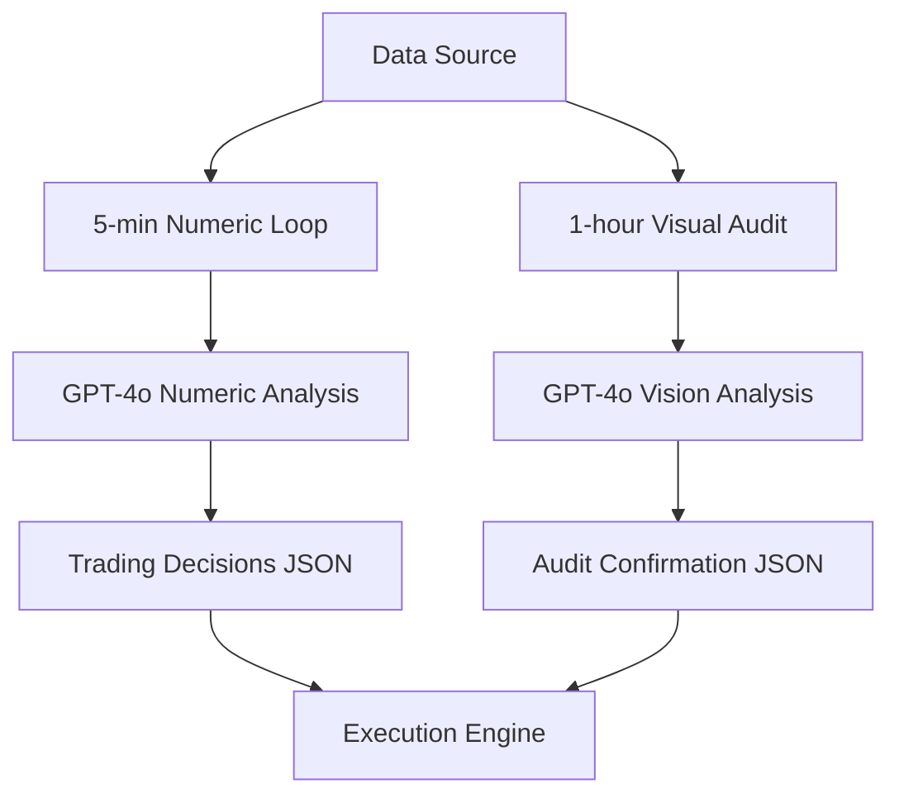

# Trading System API Workflow Documentation

## Overview
This document outlines the dual-model trading analysis system that combines high-frequency numeric analysis with periodic visual confirmation using OpenAI's GPT-4 API.

## Architecture



## Component Details

### 1. Numeric Analysis Loop (5-minute intervals)

**Purpose:** Rapid multi-timeframe analysis for real-time trading decisions

**Input Format:**
```
sym=3 t=1724578800 p=42.8 exec_tf=5 TF=[10080,1440,240,60,15,5] 
px_z=[0.2,-0.3,-0.1,0.1,0.3,0.4] v_z=[0.5,0.4,0.2,0.8,1.2,1.5] 
vwap_z=[-0.1,0.0,0.2,0.3,0.8,1.4] cvd_s=[0.1,0.05,-0.02,0.08,0.12,0.18]
oi_d=[0.02,0.01,0.00,0.03,0.05,0.06] liq_n=[0.8,0.9,1.0,1.1,1.2,1.3]
reg=[0,0,1,1,1,1] L_sup=42.3 L_res=43.1 L_q_bid=2.1 L_q_ask=3.4
```

**Output Schema:**
```json
{
  "sym": 3,
  "t": 1724578800,
  "p": 42.8,
  "sA": 2,        // Setup alignment score
  "fA": 5,        // Flow alignment score  
  "confA": 86,    // Overall confidence
  "prob_cont": 78,// Probability of continuation
  "sc_in": 67,    // Scale-in score
  "sc_out": 10,   // Scale-out score
  "hold": 2,      // Hold duration (periods)
  "tp_atr": 1.4,  // Take profit in ATR units
  "sl_atr": 0.7,  // Stop loss in ATR units
  "hedge": 12,    // Hedge percentage
  "reasons": [1,5,7,14] // Reason codes
}
```

### 2. Visual Audit System (1-hour intervals)

**Purpose:** Validate numeric signals against actual chart patterns

**Input Components:**
- Numeric summary string
- Base64-encoded chart image (CVD/OI/Price/VWAP overlays)

**Output Schema:**
```json
{
  "sym": 3,
  "t": 1724578800,
  "p": 42.8,
  "numeric_ok": 1,      // Numeric signals valid (0/1)
  "visual_confirms": 1,  // Visual patterns confirm (0/1)
  "notes": "CVD shows accumulation matching numeric signals"
}
```

## Implementation Examples

### Example 1: Basic Numeric Analysis Call

```bash
#!/bin/bash

OPENAI_KEY="your-api-key"
MODEL="gpt-4o"

# Prepare data (from your data pipeline)
NUMERIC_DATA="sym=3 t=$(date +%s) p=42.8 exec_tf=5 TF=[10080,1440,240,60,15,5] px_z=[0.2,-0.3,-0.1,0.1,0.3,0.4]"

# Make API call
RESPONSE=$(curl -s -X POST https://api.openai.com/v1/chat/completions \
  -H "Authorization: Bearer $OPENAI_KEY" \
  -H "Content-Type: application/json" \
  -d "{
    \"model\": \"$MODEL\",
    \"messages\": [
      {
        \"role\": \"system\",
        \"content\": \"You are a rapid MTF analyzer. Output minified JSON: {sym,t,p,sA,fA,confA,prob_cont,sc_in,sc_out,hold,tp_atr,sl_atr,hedge,reasons:[]}\"
      },
      {
        \"role\": \"user\",
        \"content\": \"$NUMERIC_DATA\"
      }
    ],
    \"temperature\": 0.1,
    \"max_tokens\": 200
  }")

# Extract content
echo $RESPONSE | jq -r '.choices[0].message.content'
```

### Example 2: Visual Audit with Chart Image

```python
import base64
import requests
import json

def visual_audit(numeric_summary, chart_path, api_key):
    # Encode chart image
    with open(chart_path, "rb") as image_file:
        base64_image = base64.b64encode(image_file.read()).decode('utf-8')
    
    headers = {
        "Authorization": f"Bearer {api_key}",
        "Content-Type": "application/json"
    }
    
    payload = {
        "model": "gpt-4o",
        "messages": [
            {
                "role": "system",
                "content": "Trading auditor. Compare chart with numeric data. Return JSON: {sym,t,p,numeric_ok,visual_confirms,notes}"
            },
            {
                "role": "user",
                "content": [
                    {"type": "text", "text": numeric_summary},
                    {
                        "type": "image_url",
                        "image_url": {
                            "url": f"data:image/png;base64,{base64_image}"
                        }
                    }
                ]
            }
        ],
        "temperature": 0.1,
        "max_tokens": 150
    }
    
    response = requests.post(
        "https://api.openai.com/v1/chat/completions",
        headers=headers,
        json=payload
    )
    
    return json.loads(response.json()['choices'][0]['message']['content'])

# Usage
result = visual_audit(
    "sym=3 t=1724578800 p=42.8 cvd_s5=0.18 prob_cont=78",
    "chart.png",
    "your-api-key"
)
```

## Workflow Integration

### n8n Workflow Structure

```yaml
Workflow:
  - Schedule Trigger (5 min):
      -> Fetch Market Data
      -> Format Numeric String
      -> Call Numeric Analysis API
      -> Parse JSON Response
      -> Execute Trading Logic
      
  - Schedule Trigger (1 hour):
      -> Generate Chart Image
      -> Prepare Numeric Summary
      -> Call Visual Audit API
      -> Validate Signals
      -> Adjust Risk Parameters
```

### Complete Processing Pipeline

```javascript
// Node.js example for complete pipeline
const axios = require('axios');
const fs = require('fs');

class TradingAnalyzer {
  constructor(apiKey) {
    this.apiKey = apiKey;
    this.apiUrl = 'https://api.openai.com/v1/chat/completions';
  }

  async analyzeNumeric(marketData) {
    const numericString = this.formatNumericData(marketData);
    
    const response = await axios.post(this.apiUrl, {
      model: 'gpt-4o',
      messages: [
        {
          role: 'system',
          content: 'Rapid MTF analyzer. Output JSON trading signals.'
        },
        {
          role: 'user',
          content: numericString
        }
      ],
      temperature: 0.1,
      max_tokens: 200
    }, {
      headers: {
        'Authorization': `Bearer ${this.apiKey}`,
        'Content-Type': 'application/json'
      }
    });

    return JSON.parse(response.data.choices[0].message.content);
  }

  async auditWithVisual(numericSummary, chartPath) {
    const imageBase64 = fs.readFileSync(chartPath, 'base64');
    
    const response = await axios.post(this.apiUrl, {
      model: 'gpt-4o',
      messages: [
        {
          role: 'system',
          content: 'Trading auditor. Validate signals against charts.'
        },
        {
          role: 'user',
          content: [
            { type: 'text', text: numericSummary },
            {
              type: 'image_url',
              image_url: {
                url: `data:image/png;base64,${imageBase64}`
              }
            }
          ]
        }
      ],
      temperature: 0.1,
      max_tokens: 150
    }, {
      headers: {
        'Authorization': `Bearer ${this.apiKey}`,
        'Content-Type': 'application/json'
      }
    });

    return JSON.parse(response.data.choices[0].message.content);
  }

  formatNumericData(data) {
    return `sym=${data.symbol} t=${data.timestamp} p=${data.price} ` +
           `TF=${JSON.stringify(data.timeframes)} ` +
           `px_z=${JSON.stringify(data.priceZScores)} ` +
           `v_z=${JSON.stringify(data.volumeZScores)} ` +
           // ... additional fields
           `pos=${data.position} avg=${data.avgPrice}`;
  }
}

// Usage
const analyzer = new TradingAnalyzer('your-api-key');

// 5-minute loop
setInterval(async () => {
  const marketData = await fetchMarketData();
  const signals = await analyzer.analyzeNumeric(marketData);
  await executeTrades(signals);
}, 5 * 60 * 1000);

// 1-hour audit
setInterval(async () => {
  const chart = await generateChart();
  const summary = getCurrentNumericSummary();
  const audit = await analyzer.auditWithVisual(summary, chart);
  await updateRiskParameters(audit);
}, 60 * 60 * 1000);
```

## Input Data Field Reference

### Numeric Features (5-min)

| Field | Description | Example |
|-------|-------------|---------|
| `sym` | Symbol ID | 3 |
| `t` | Unix timestamp | 1724578800 |
| `p` | Current price | 42.8 |
| `TF` | Timeframes in minutes | [10080,1440,240,60,15,5] |
| `px_z` | Price z-scores per TF | [0.2,-0.3,-0.1,0.1,0.3,0.4] |
| `v_z` | Volume z-scores per TF | [0.5,0.4,0.2,0.8,1.2,1.5] |
| `vwap_z` | VWAP z-scores | [-0.1,0.0,0.2,0.3,0.8,1.4] |
| `cvd_s` | CVD slopes per TF | [0.1,0.05,-0.02,0.08,0.12,0.18] |
| `oi_d` | OI deltas per TF | [0.02,0.01,0.00,0.03,0.05,0.06] |
| `liq_n` | Liquidity normalized | [0.8,0.9,1.0,1.1,1.2,1.3] |
| `reg` | Regression signals | [0,0,1,1,1,1] |
| `L_sup` | Support level | 42.3 |
| `L_res` | Resistance level | 43.1 |
| `L_q_bid` | Bid liquidity | 2.1 |
| `L_q_ask` | Ask liquidity | 3.4 |
| `basis_bp` | Basis in bps | 6.5 |
| `fund_bp` | Funding in bps | 1.2 |
| `pos` | Current position | 0.75 |
| `avg` | Average entry | 42.5 |
| `unrlz` | Unrealized P&L | 0.71 |

### Output Signal Codes

| Code | Meaning |
|------|---------|
| 1 | Strong momentum |
| 2 | Volume confirmation |
| 3 | VWAP support |
| 4 | CVD accumulation |
| 5 | OI increase |
| 6 | Liquidity imbalance |
| 7 | Multi-TF alignment |
| 8 | Support bounce |
| 9 | Resistance rejection |
| 10 | Funding favorable |
| 11 | Basis convergence |
| 12 | Risk limit |
| 13 | Divergence warning |
| 14 | Regime change |
| 15 | Stop triggered |

## Error Handling

```javascript
async function safeApiCall(func, maxRetries = 3) {
  for (let i = 0; i < maxRetries; i++) {
    try {
      return await func();
    } catch (error) {
      if (error.response?.status === 429) {
        // Rate limited - wait exponentially
        await new Promise(r => setTimeout(r, Math.pow(2, i) * 1000));
      } else if (error.response?.status >= 500) {
        // Server error - retry
        await new Promise(r => setTimeout(r, 1000));
      } else {
        // Client error - don't retry
        throw error;
      }
    }
  }
  throw new Error('Max retries exceeded');
}
```

## Performance Optimization

### 1. Batch Processing
Group multiple symbols into single API calls when possible.

### 2. Response Caching
Cache visual audit results for identical chart patterns.

### 3. Token Optimization
- Use minified JSON output format
- Compress numeric arrays
- Limit system prompt length

### 4. Cost Management
- 5-min numeric: ~150 tokens/call = ~$0.003
- 1-hour visual: ~500 tokens/call = ~$0.01
- Daily cost per symbol: ~$1.20

## Testing & Validation

```bash
# Test numeric analysis
./test_numeric.sh sample_data.txt expected_output.json

# Test visual audit
python test_visual.py sample_chart.png expected_audit.json

# Validate JSON schemas
python validate_schemas.py output.json schemas/trading_signal.json
```

## Monitoring & Logging

```javascript
// Log all API interactions
function logApiCall(type, input, output, latency) {
  const log = {
    timestamp: Date.now(),
    type,
    input_size: JSON.stringify(input).length,
    output,
    latency_ms: latency,
    model: 'gpt-4o',
    tokens_estimated: estimateTokens(input, output)
  };
  
  fs.appendFileSync('api_logs.jsonl', JSON.stringify(log) + '\n');
}
```

## Security Considerations

1. **API Key Management**
   - Store in environment variables
   - Never commit to version control
   - Rotate regularly

2. **Input Validation**
   - Sanitize all numeric inputs
   - Validate image file formats
   - Check data boundaries

3. **Output Validation**
   - Parse JSON safely
   - Validate signal ranges
   - Implement circuit breakers

## Troubleshooting

| Issue | Solution |
|-------|----------|
| JSON parse errors | Add `response_format: {type: "json_object"}` |
| Rate limiting | Implement exponential backoff |
| Image too large | Resize to max 2048x2048 |
| Inconsistent outputs | Lower temperature to 0.0 |
| High latency | Use `gpt-4o-mini` for testing |

## Additional Resources

- [OpenAI API Documentation](https://platform.openai.com/docs/api-reference)
- [GPT-4 Vision Guide](https://platform.openai.com/docs/guides/vision)
- [Rate Limits & Quotas](https://platform.openai.com/docs/guides/rate-limits)
- [JSON Mode](https://platform.openai.com/docs/guides/text-generation/json-mode)