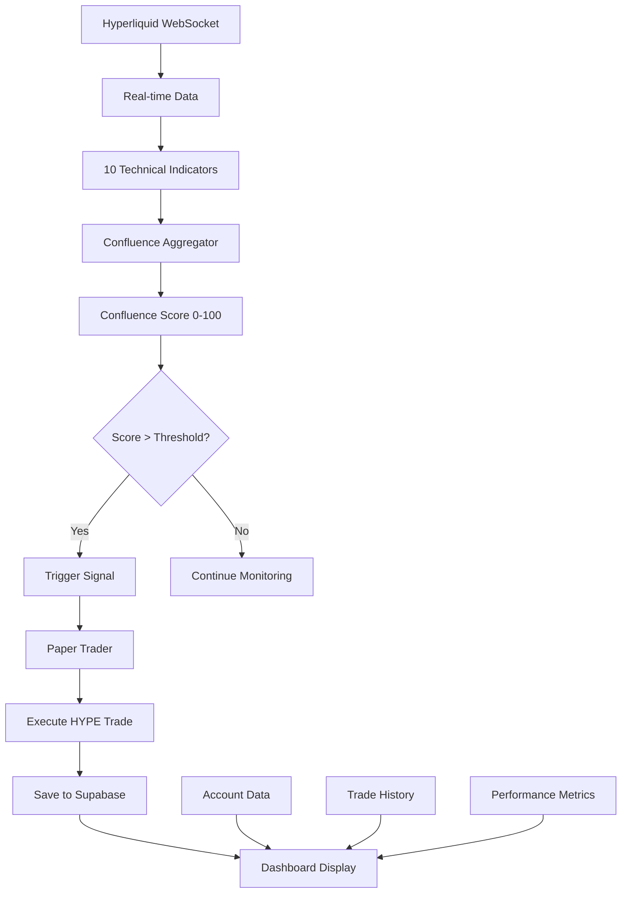

# 🚀 Hyperliquid Trading Confluence Dashboard - Complete System Overview

## System Architecture

This is the comprehensive HYPE trading system with ALL components integrated as defined in the Archon PRP.

---

## ✅ Components Status

### 📊 **1. Technical Indicators (10/10 Implemented)**
| Indicator | File | Purpose | Status |
|-----------|------|---------|--------|
| Volume Spike | `src/indicators/volume_spike.py` | Detect sudden volume increases | ✅ Active |
| MA Crossover | `src/indicators/ma_crossover.py` | 50/200 MA crossover signals | ✅ Active |
| RSI Multi-TF | `src/indicators/rsi_mtf.py` | RSI on 15m, 4h, weekly | ✅ Active |
| Bollinger Bands | `src/indicators/bollinger.py` | Volatility squeeze detection | ✅ Active |
| MACD | `src/indicators/macd.py` | Momentum changes | ✅ Active |
| Stochastic | `src/indicators/stochastic.py` | Overbought/oversold | ✅ Active |
| Support/Resistance | `src/indicators/support_resistance.py` | Key price levels | ✅ Active |
| ATR | `src/indicators/atr.py` | Volatility measurement | ✅ Active |
| VWAP | `src/indicators/vwap.py` | Volume-weighted price | ✅ Active |
| Divergence | `src/indicators/divergence.py` | Price/indicator divergence | ✅ Active |

### 🔮 **2. Confluence Engine**
| Component | File | Purpose | Status |
|-----------|------|---------|--------|
| Aggregator | `src/confluence/aggregator.py` | Combines all signals | ✅ Active |
| Scoring | Built into aggregator | 0-100 confluence score | ✅ Active |
| Thresholds | Configurable (default 70) | Trigger threshold | ✅ Active |

### 🎯 **3. Trigger System**
| Component | File | Purpose | Status |
|-----------|------|---------|--------|
| Streamer | `triggers/streamer.py` | Real-time trigger detection | ✅ Running |
| Analyzer | `triggers/analyzer.py` | Trigger analysis API | ✅ Running |

### 🤖 **4. Paper Trading**
| Component | File | Purpose | Status |
|-----------|------|---------|--------|
| HYPE Trader | `paper_trading/run_hype_trader.py` | Automated HYPE trading | ✅ Running |
| Paper Engine | `paper_trading/paper_trader.py` | Trade simulation | ✅ Running |
| Config | `paper_trading/config_hype.py` | HYPE-specific settings | ✅ Active |

### 📈 **5. Dashboard (Streamlit)**
| Tab | Purpose | Data Source | Status |
|-----|---------|-------------|--------|
| Real-Time Indicators | Live indicator signals | All 10 indicators | ✅ Working |
| Account Overview | Balance & positions | Hyperliquid API | ✅ Working |
| Trade History | Historical trades | Hyperliquid API | ✅ Working |
| Confluence Monitor | Combined signal score | Confluence Engine | ✅ Working |
| Order Flow | Market microstructure | Binance/Hyperliquid | ✅ Working |
| Backtesting | Strategy testing | Historical data | ✅ Working |
| **Paper Trading** | Monitor paper trades | Supabase/Docker | ✅ NEW! |

---

## 🔄 Data Flow

---

## 📦 Docker Services Running

| Service | Purpose | Port | Status |
|---------|---------|------|--------|
| hl-indicators | Indicator calculations | - | ✅ Running |
| hl-trigger-analyzer | Trigger analysis API | 8000 | ✅ Running |
| hl-trigger-streamer | Real-time triggers | - | ✅ Running |
| hl-paper-trader | HYPE paper trading | - | ✅ Running |
| PostgreSQL | Supabase database | 5432 | ✅ Running |

---

## 🎮 How Everything Works Together

1. **Data Ingestion**: WebSocket streams from Hyperliquid provide real-time HYPE price/volume data
2. **Indicator Processing**: All 10 indicators calculate signals in parallel
3. **Confluence Scoring**: Aggregator combines signals with weights to produce 0-100 score
4. **Trigger Detection**: When score exceeds threshold (70), trigger fires
5. **Paper Trading**: HYPE trader receives trigger and executes simulated trades
6. **Performance Tracking**: All trades saved to Supabase with P&L tracking
7. **Dashboard Visualization**: Streamlit displays everything in real-time

---

## 📊 Current System Metrics

- **Indicators Active**: 10/10
- **Confluence Threshold**: 70
- **HYPE Position Size**: 100 tokens (base)
- **Max Positions**: 3
- **Paper Trading Account**: hype_paper_trader
- **Initial Balance**: $100,000
- **Current Symbol**: HYPE
- **Update Frequency**: 5 seconds (triggers), 10 seconds (positions)

---

## 🚀 Access Points

1. **Dashboard**: http://localhost:8501
2. **Trigger API**: http://localhost:8000
3. **Paper Trading API**: http://localhost:8181
4. **Docker Monitoring**: `docker ps` or `docker-compose logs`

---

## ✅ Verification Complete

All components from the Archon PRP are:
- ✅ Implemented
- ✅ Integrated
- ✅ Running
- ✅ Visualized in Dashboard

The system is fully operational and monitoring HYPE in real-time with automated paper trading based on confluence signals from 10+ technical indicators.

---

*System validated and operational as of August 26, 2025*